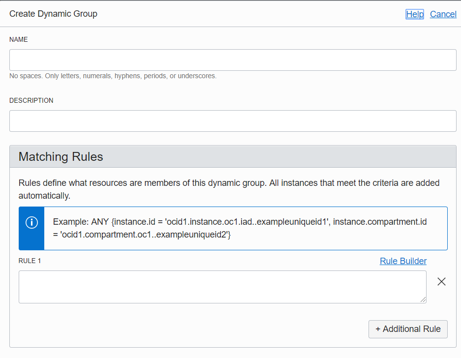
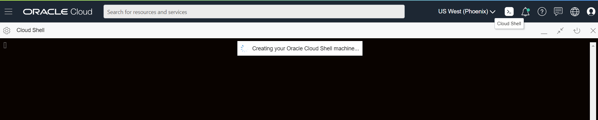
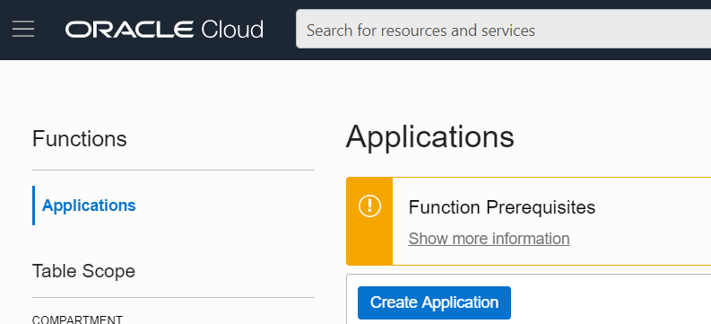
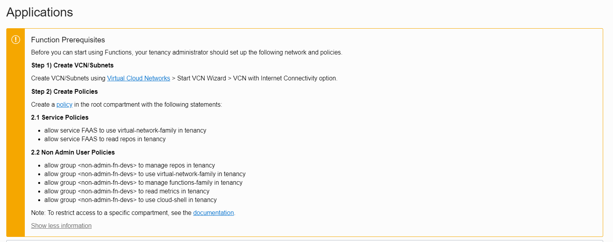
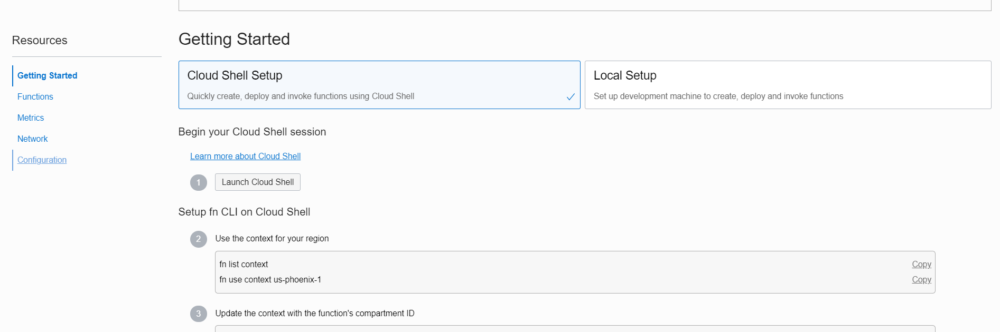
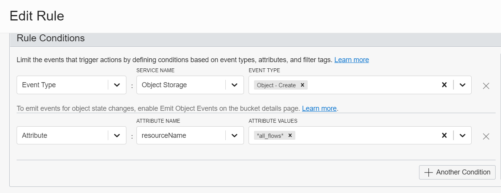

# Splunk-Export-Flow-Logs


## Table Of Contents

- [Splunk-Export-Flow-Logs](#splunk-export-flow-logs)
  - [Table Of Contents](#table-of-contents)
  - [Introduction](#introduction)
  - [Design Goals](#design-goals)
  - [Components](#components)
  - [Other Concepts](#other-concepts)
  - [Flow Log Enrichment Functionality](#flow-log-enrichment-functionality)
  - [Setup a Splunk Trial for Testing](#setup-a-splunk-trial-for-testing)
  - [Pre-requisites](#pre-requisites)
  - [Scope of Tutorial](#scope-of-tutorial)
  - [Quickstart For Setup On OCI Side](#quickstart-for-setup-on-oci-side)
    - [Create Compartments and Groups](#create-compartments-and-groups)
    - [Create a Dynamic Group](#create-a-dynamic-group)
    - [Create Tenancy IAM policy - Flow Log Dynamic Group](#create-tenancy-iam-policy---flow-log-dynamic-group)
    - [Create Compartment Level IAM Policy](#create-compartment-level-iam-policy)
    - [Create a VCN, Subnet & Security Lists](#create-a-vcn-subnet--security-lists)
    - [Configure Cloud Shell](#configure-cloud-shell)
    - [The Cloud Shell](#the-cloud-shell)
    - [Create a Function Application](#create-a-function-application)
    - [Getting Started with Fn Deployment](#getting-started-with-fn-deployment)
    - [Step-8](#step-8)
    - [Deploy the Functions](#deploy-the-functions)
    - [Set the Environment Variables for Each Function](#set-the-environment-variables-for-each-function)
    - [Deploy Event Rules](#deploy-event-rules)

## Introduction

The Flow Logs of a VCN is central to any kind of debugging in the network and proves to be an extremely useful tool in understanding traffic flow patterns in the context of security as well.

## Design Goals

```
Event driven
Scalable
Low-Cost
Zero maintenance
Secure
Least Privilege Access
```


## Components

- The `VCN Flow Logs` are what helps understand the flow of network traffic in a given subnet.
- The `OCI Logging Service` is required to enable flow log collection and storage for a given subnet. The OCI Logging service can be used to collect logs for other Oracle Cloud Native Services as well.
- The `OCI Events Service` is used to trigger Functions every time the Logging service creates an object with the flow logs of a given Subnet.
- The `OCI Functions` trigger a Function that enriches flow-logs and publishes events to the Splunk HTTP Event Collector End point.
- The `Splunk HTTP Event Collector` is a simplified mechanism that splunk provides to publish events in a standard format


## Other Concepts

- [VCN](https://docs.cloud.oracle.com/en-us/iaas/Content/Network/Concepts/overview.htm) Flow Logs are generated for every subnet.
- The [Subnet](https://docs.cloud.oracle.com/en-us/iaas/Content/General/Concepts/regions.htm#one) is a regional resource and therefore this has to be setip for every region your tenancy is subscribed to.
- The architecture uses Logging service that populates logs of a given resource in the Object Storage of a compartment.
- Event Service Triggers are scoped to a given compartment , so it is necessary to configure logging to populate logs in a single compartment.
- If there is a requirement to have the logs populated in multiple compartments eg. **PROD**, **UAT** etc. or , you would have to create as many events as there are compartments where VCN Flow Logs are written.

## Flow Log Enrichment Functionality

**Raw Log**

```
HEADERS
--------
<version>
<srcaddr>
<dstaddr>
<srcport>
<dstport>
<protocol>
<packets>
<bytes>
<start_time>
<end_time>
<action>
<status>

2 172.16.2.145 172.16.2.179 82 64 13 112 441 1557424462 1557424486 REJECT OK
```

**Enriched JSON**

```
{
    "version": "",
    "srcaddr": "-",
    "dstaddr": "-",
    "srcport": "-",
    "dstport": "-",
    "protocol": "-",
    "packets": "-",
    "bytes": "-",
    "start_time": "",
    "end_time": "
    "status": "",
    "compartmentId": "",
    "compartmentName": "",
    "availabilityDomain": "",
    "vcnId": "",
    "vcnName": "",
    "subnetId": "",
    "subnetName": "",
    "vnicId": "",
    "vnicName": "",
    "securityListIds": [""],
    "securityListNames": [""],
    "nsgIds": [],
    "nsgNames": []
}
```

## Setup a Splunk Trial for Testing

- Splunk provides a 15 day Cloud trial and the capability to store about 5GB worth of event data that you forward/export to Splunk. Here's the link to sign-up [Splunk Sign Up](https://www.splunk.com/en_us/download.html)
- Select Splunk-Cloud, provide your data and Login to Splunk.
- To setup the HTTP Event Collector which we leverage, the solution refer to link [Setup HTTP event collector](https://docs.splunk.com/Documentation/Splunk/8.0.2/Data/UsetheHTTPEventCollector)
- Points to note

## Pre-requisites

- Whitelist your Tenancy for Logging
- Whitelist your Tenancy for VCN Flow Logs

Here's the [link](https://go.oracle.com/LP=78019?elqCampaignId=179851) to the process for Cloud Native LA.

## Scope of Tutorial

- This tutorial does not help you setup OCI Logging in the tenancy, you will recieve a document from oracle once the tenancy is whitelisted to help setup logging in tenancy.
- The recommendation as per this architecture is to have a dedicated logging compartment that fetches resources from multiple compartments and populates logs in a single compartment.
- This reduces the number of Event Rules to be written and number of Function Deployments.

## Quickstart For Setup On OCI Side

This quickstart assumes you have working understanding of basic principles of OCI around IAM | Networking and you know how to get around the OCI Console. Since Flow Logs contain sensitive network Information,

### Create Compartments and Groups

- `Burger-Menu` --> `Identity` --> `Compartments | Users | Groups`

1. Create a Compartment `flow-log-compartment`
2. Create a Dynamic Group `flow-log-dg`
3. Write appropriate IAM Policies at the tenancy level and compartment level.

### Create a Dynamic Group

- `Burger-Menu` --> `Identity` --> `Dynamic Groups`
- Create a Dynamic Group `flow-log-dg` Instances that meet the criteria defined by any of these rules will be included in the group.



```
ANY {resource.type = 'fnfunc', resource.compartment.id = [flow-log-compartment OCID]}
```

### Create Tenancy IAM policy - Flow Log Dynamic Group

This policy is to allow for enriching flow logs with VCN Information and Compartment Information based on the flow log data recieved

- `Burger-Menu` --> `Identity` --> `Policies`
- Create an IAM Policy `flow-log-dg-tenancy-policy` with the following policy statements in the `root` compartment

```
Allow dynamic-group flow-log-dg to read virtual-network-family in tenancy
Allow dynamic-group flow-log-dg to read compartments in tenancy
```

### Create Compartment Level IAM Policy

- `Burger-Menu` --> `Identity` --> `Policies`
  Create an IAM Policy `flow-log-dg-compartment-policy` inside the compartment `flow-log-compartment`

```
Allow dynamic-group flow-log-dg to read objects in compartment flow-log-compartment
Allow dynamic-group flow-log-dg to use virtual-network-family in compartment flow-log-compartment
```

### Create a VCN, Subnet & Security Lists

- `Burger-Menu` --> `Networking` --> `Virtual Cloud Networks`
- Use VCN Quick Start to Create a VCN `flow-log-vcn` .
- Create only a private-subnet `flow-log-private-subnet`
- Go to Security List and Delete all a `Stateful Ingress Rules` in the `Default Security list` .
- Go to Default Security List and create a `Stateful Egress Rule` is available in the `Default Security List` to allow egress traffic for
  - `0.0.0.0/0` on port `443` protocol `TCP`
  - `0.0.0.0/0` on port `8088` protocol `TCP`
  - `0.0.0.0/0` on port `53` protocol `UDP`

### Configure Cloud Shell



Setup Cloud Shell in your tenancy - [Link](https://docs.cloud.oracle.com/en-us/iaas/Content/API/Concepts/cloudshellgettingstarted.htm?TocPath=Developer%20Tools%20%7C%7CUsing%20Cloud%20Shell%7C_____0)

### The Cloud Shell

- Oracle Cloud Infrastructure Cloud (OCI) Shell is a web browser-based terminal accessible from the Oracle Cloud Console.
- Cloud Shell provides access to a Linux shell, with a pre-authenticated Oracle Cloud Infrastructure CLI, a pre-authenticated Functions, Ansible installation, and other useful tools for following Oracle Cloud Infrastructure service tutorials and labs.

### Create a Function Application

- `Burger-Menu` --> `Developer Services` --> `Functions`
- Create a Function Application `flow-log-app` in the compartment `flow-log-compartment` while selecting `flow-log-vcn` and the `Private Subnet`



If you are not an IAM Policy Expert, just create these policies as shown in the Function Pre-requisites


- Setup Papertrail / OCI Logging Service to debug Function executions if required. [Setup PaperTrail](https://papertrailapp.com/) , check them out.

### Getting Started with Fn Deployment

Click on the Getting started Icon after Function Application Creation is done.



Follow the steps on the screen for simplified Fn Deployment. While you have the option of local Fn Development environment, I'd recommend using the cloud shell if you simply want to deploy Functions.

Follow the steps until **Step-7**

### Step-8

Instead of creating a new fn we are deploying an existing function. So clone

Clone the Repo in the cloud shell
`git clone https://github.com/vamsiramakrishnan/splunk-export-logs.git`

### Deploy the Functions

Each folder within the repo represents a function , go to each folder and deploy the function using the the `fn --verbose deploy`

```
cd splunk-export-logs
cd enrich-flow-logs
fn --verbose deploy flow-log-app enrich-flow-logs
```

The Deploy Automatically Triggers an Fn Build and Fn Push to the Container registry repo setup for the functions.

### Set the Environment Variables for Each Function

These environment variables help call other functions. One after the other.

| Fn-Name          | Parameter Name     | Description                                                                                               | Example                                   |
| ---------------- | ------------------ | --------------------------------------------------------------------------------------------------------- | ----------------------------------------- |
| enrich-flow-logs | source_source_name | The Source Name that you would like Splunk to see                                                         | oci-hec-event-collector                   |
| enrich-flow-logs | source_host_name   | Source Hostname that you would like Splunk to see                                                         | oci-vcn-flow-logs                         |
| enrich-flow-logs | splunk_url         | Splunk Cloud URL ( Append input to the beginning of your splunk cloud url, do not add any http/https etc. | input-prd-p-hh6835czm4rp.cloud.splunk.com |
| enrich-flow-logs | splunk_hec_token   | The Token that is unqiue to that HEC                                                                      | TOKEN                                     |
| enrich-flow-logs | splunk_index_name  | The index into which you'd like these logs to get aggregated                                              | main                                      |
| enrich-flow-logs | splunk_hec_port    | The listener port of the HEC Endpoint of Splunk                                                           | 8088                                      |

### Deploy Event Rules

Create an Event Rule in the compartment that gets triggered based on Service `Object Storage` on `Object-Create` under the condition that it bears attribute `all_flows`


Use Event Action to trigger the function

